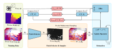
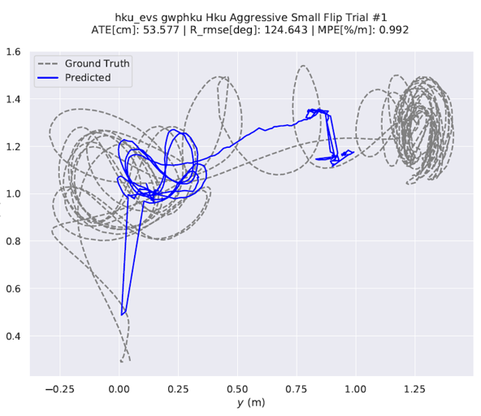
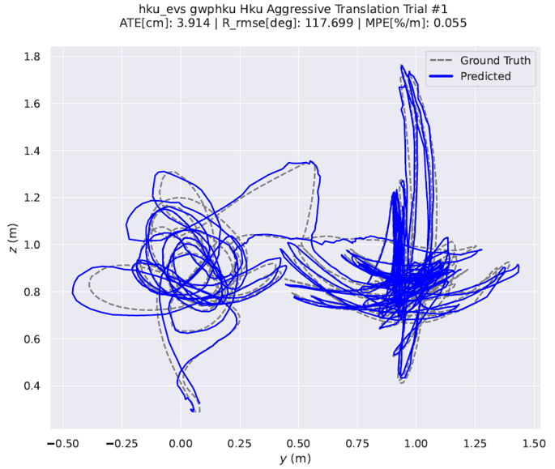
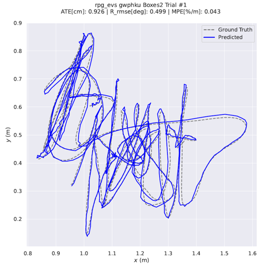
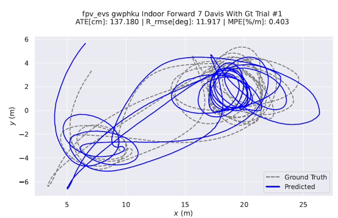

[comment]: <> (# DEVO)

<!-- PROJECT LOGO -->

  <h1 align="center"> DEVO (复现及中文注释版~仅供个人学习记录用)
  </h1>

[comment]: <> (  <h2 align="center">PAPER</h2>)
  <h3 align="center">
  <a href="https://arxiv.org/pdf/2312.09800">Paper</a> 
  | <a href="https://github.com/tum-vision/DEVO">Original Github Page</a>
  | <a href="https://blog.csdn.net/gwplovekimi/article/details/139436796?spm=1001.2014.3001.5501">CSDN DPVO的配置教程</a>
  </h3>
  

  

 

# DEVO配置记录
~~~
<!-- 创建conda环境 -->
conda env create -f environment.yml
conda activate devo

<!-- 安装eigen -->
wget https://gitlab.com/libeigen/eigen/-/archive/3.4.0/eigen-3.4.0.zip
unzip eigen-3.4.0.zip -d thirdparty

<!-- 安装DEVO -->
# install DEVO
pip install .
~~~

# 测试作者已训练好的模型
~~~
./download_model.sh
~~~
* 下载测试数据，并且对测试数据集进行处理（以HKU数据集为例）
~~~
conda activate nerf-ngp
bypy list
bypy download [remotepath] [localpath]  #注意要指定一下下载的路径~

python scripts/pp_hku.py
<!-- 注意输入为文件夹的路径 -->
python scripts/pp_hku.py --indir=datasets/HKU_dataset/
~~~
* 运行测试代码
~~~
python evals/eval_evs/eval_XXX_evs.py --datapath=<path to xxx dataset> --weights="DEVO.pth" --stride=1 --trials=1 --expname=<your name>
~~~

# 训练记录
* 下载[TartanAir](https://theairlab.org/tartanair-dataset/)中所有的数据,采用[工具](https://github.com/castacks/tartanair_tools)
~~~
cd thirdparty/tartanair_tools/
pip install boto3 #需要安装依赖~
python download_training.py --output-dir ../../datasets --rgb --depth --only-left
~~~
* 采用[vid2e/ESIM](https://github.com/KwanWaiPang/ESIM_comment)实现将video变成event
* 采用作者提供的转换代码[convert_tartan](scripts/convert_tartan.py)
~~~
conda activate vid2e
<!-- 解压文件 -->
unzip filename.zip -d foldername
unzip datasets/abandonedfactory_Easy_image_left.zip -d datasets/TartanAir

<!-- 进行数据的转换，获取event -->
pip install hdf5plugin
python scripts/convert_tartan.py --dirsfile=datasets/converted.txt

python scripts/process_training_data.py --dirsfile=datasets/converted.txt
<!-- 将数据移动到文件夹 -->
复制：cp -r 文件夹名 /media/Data/DVO
移动：mv 文件夹名 /media/Data/DVO
删除：rm -r 文件夹名
~~~

# 测试DEVO预训练模型
* 阅读验证代码[Link](evals\eval_evs\eval_hku_evs.py)
* 采用[Link](scripts\pp_hku.py)生成输入数据（注意输入应该是文件夹而非具体的rosbag），并采用DEVO预训练模型来测试~
~~~
python scripts/pp_hku.py --indir=datasets/HKU_dataset/

python evals/eval_evs/eval_hku_evs.py --datapath=/home/gwp/DEVO/datasets/HKU_dataset/ --weights="DEVO.pth" --stride=1 --trials=1 --expname=gwphku

<!-- python evals/eval_evs/eval_hku_evs.py --datapath=/home/gwp/DEVO/datasets/HKU_dataset/ --weights="DEVO.pth" --viz=True --viz_flow=True --expname=gwphku -->

<!-- 由event生成image -->
python evals/eval_e2v/eval_hku_e2v.py --indir=/home/gwp/DEVO/datasets/HKU_dataset/
~~~

  
  

* 采用rpg数据集测试
~~~
conda activate devo
python scripts/pp_rpg.py --indir=datasets/rpg/

python evals/eval_evs/eval_rpg_evs.py --datapath=/home/gwp/DEVO/datasets/rpg/ --weights="DEVO.pth" --stride=1 --trials=1 --expname=gwphku

~~~

  

* 采用UZH-FPV数据集进行测试
~~~
conda activate devo
<!-- 处理数据 -->
python scripts/pp_fpv.py --indir=datasets/uzh-fpv/

<!-- 运行测试,注意要先修改splits中读入的序列 -->
python evals/eval_evs/eval_fpv_evs.py --datapath=/home/gwp/DEVO/datasets/uzh-fpv/ --weights="DEVO.pth" --stride=1 --trials=1 --expname=gwphku

~~~

  

# 系列Debug
* 运行下面代码时报错，是因为弹窗可视化不行~~~应该是画读取数据的过程
~~~
python scripts/pp_hku.py --indir=/home/gwp/DEVO/datasets/HKU_dataset/
from evo.tools import plot

ImportError: Cannot load backend 'TkAgg' which requires the 'tk' interactive framework, as 'headless' is currently running
~~~
* 代码中打断点
~~~
import pdb #打断点用的
pdb.set_trace()

c：(continue)继续执行
w：(words)显示当前行的上下文信息
a：(arguments)打印当前函数的参数列表
s：(stop)执行当前行，并在第一个可能的时机停止
n：(next)继续执行直到当前函数的下一行或者函数返回值
q:退出
~~~
